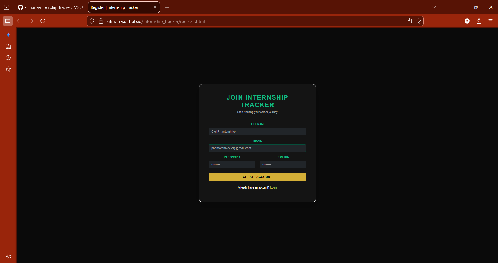
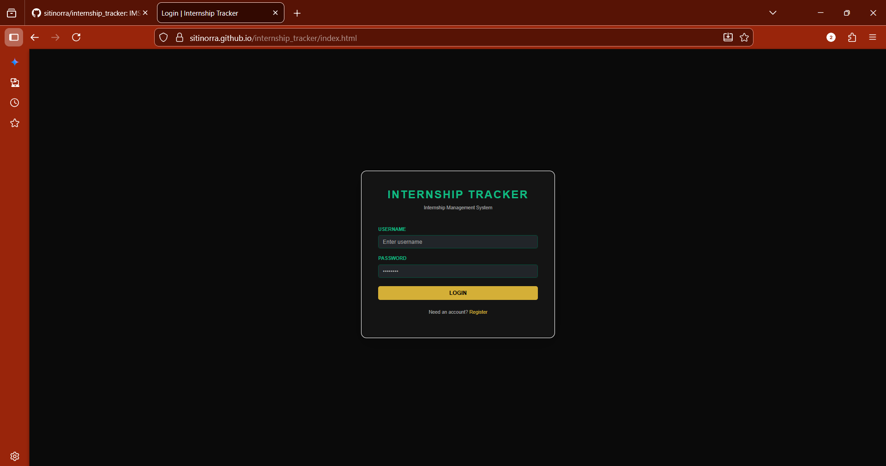
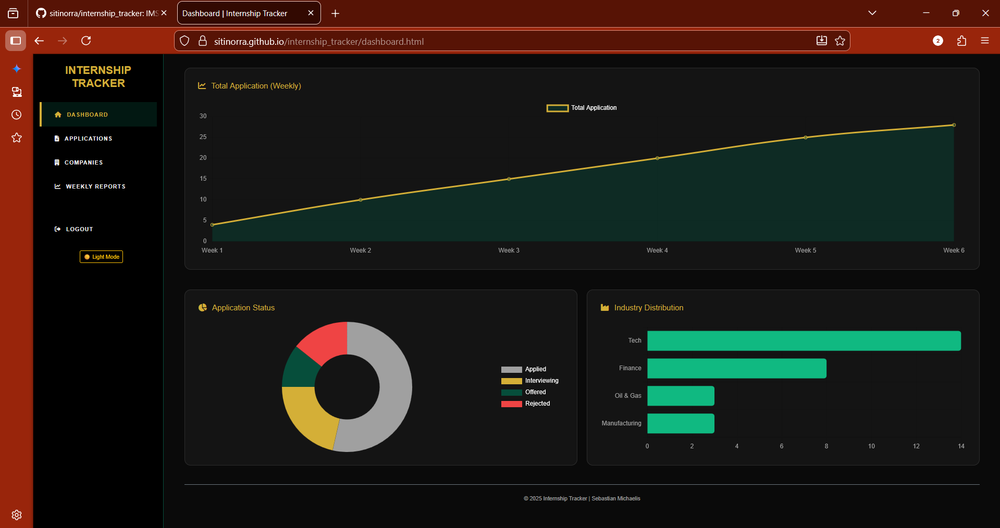
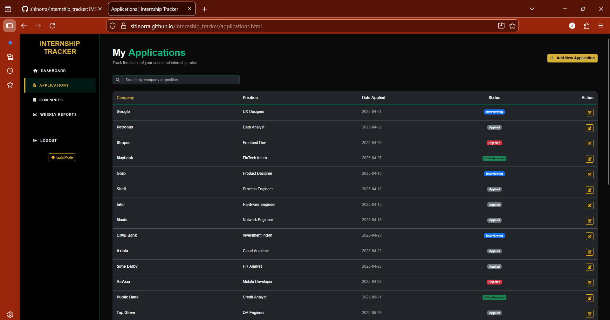
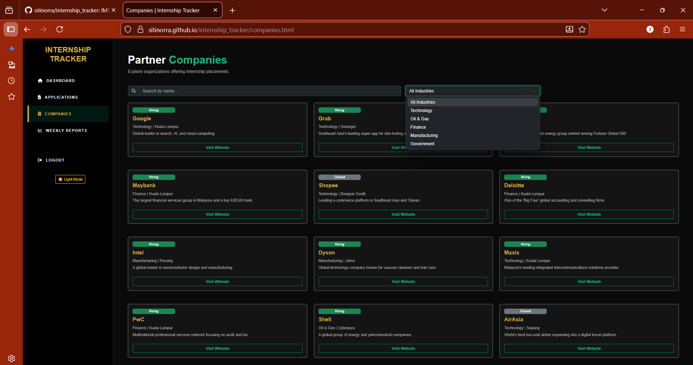
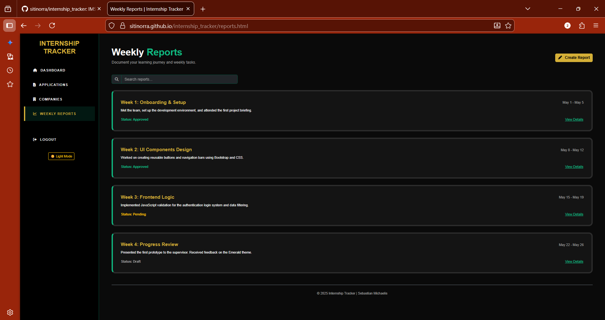

# 🚀 Internship Tracker
IMS566 pairing project

## Internship Tracker Web Application System

The Internship Tracker Web Application System is a web-based interface designed to help students organize and monitor their internship activities more efficiently. It provides a centralized platform for logging applications, tracking progress, and managing weekly reports.

## 👥 Prepared By

- Siti Nor Ra Binti Basri (2025121113) 

- Nur Zulaikha Binti Md Sani (2025301403)

Academic Context: This project was developed for IMS566: Advanced Web Design Development and Content Management at Universiti Teknologi MARA (UiTM), Puncak Perdana Campus, under the guidance of Dr. Hazila Binti Timan.

## ✨ Features

- Authentication Interface: Includes a simulated login and registration system with error handling for incorrect credentials.
   
- Interactive Dashboard: Features a summary of internship progress with data visualization elements like charts to track statuses and industry distribution.
   
- Application Management: A structured table to view application details such as company name, position, and current status.
   
- Company Tracking: Helps users keep track of potential or confirmed organizations offering placements.
   
- Weekly Progress Reports: Supports basic content management by organizing tasks and activities into systematic weekly entries.
   
- UI Customization: Includes a Light/Dark Mode toggle and a consistent navigation menu for a better user experience.
   
- Responsive Design: Developed using responsive principles to ensure functionality across desktop and mobile devices.

## 🛠️ Frameworks & Libraries Used

This system focuses on front-end development and is deployed via GitHub Pages.

- HTML: Structure and content organization.

- CSS: Interface styling and visual enhancement.

- JavaScript: Client-side interactions and login validation logic.

- Bootstrap 5: For a responsive, mobile-friendly layout.

- Chart.js: For data visualization and dashboard charts.

## 🚀 Testing Instructions

To test the system functionality, visit the live demo: 
**Live Demo:** [sitinorra.github.io/internship_tracker/](https://sitinorra.github.io/internship_tracker/)

Test Login Credentials:
      
- Username: Sebastian Michaelis 

- Password: Phantomhive
      
📌Note: The registration interface is provided for demonstration purposes only, as the system currently uses simulated hardcoded credentials.
       
**Clone the repository:**
git clone [https://github.com/sitinorra/internship_tracker.git](https://github.com/sitinorra/internship_tracker.git) 

## 🚀 Conclusion

The development of this system successfully provides a structured and user-friendly platform that addresses common student challenges like disorganized record-keeping. It demonstrates the practical application of advanced web development concepts and system design principles learned throughout the programme.

**Registration Page:**

**Login Page:**

**Dashboard Page:**

**Dashboard Page:**

**Applications Page:**

**Companies Page:**

**Weekly Report Page:**

